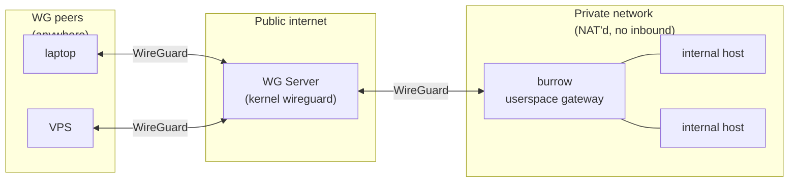
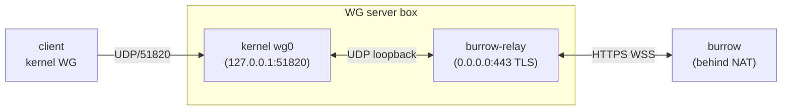

# burrow

Userspace WireGuard gateway. No TUN, no kernel drivers, no admin.

- [TL;DR](#tldr)
- [Quick start](#quick-start)
- [Examples](#examples)
- [Commands](#commands)
- [How it works](#how-it-works)
- [Limitations](#limitations)
- [Development](#development)
- [License](#license)

## TL;DR

burrow is a WireGuard peer you drop inside a private network. It acts
as a transparent MASQUERADE for other peers reaching internal hosts,
and adds SSH `-R`-style reverse tunnels (bound on real OS listeners),
a DNS resolver, and a remote shell over one control channel.

Built on [boringtun](https://github.com/cloudflare/boringtun) and
[smoltcp](https://github.com/smoltcp-rs/smoltcp).

Three-party setup: a publicly-reachable WG server in the middle, a
burrow gateway sitting inside some private network, and any number of
WG peers (your laptop, a VPS, whatever). burrow bridges the WG side to
the private LAN.



Reverse tunnels flip the direction. Any machine on burrow's network
(WG peer, LAN host, the public internet if burrow is reachable there)
hits a real OS listener on the burrow host; the connection rides back
to whichever client called `tunnel start` and is originated locally.


## Quick start

Three boxes — a public WG server, the burrow gateway behind NAT, and
one or more clients. Decisions live in **one TOML file per
deployment**, under `deployments/<name>/spec.toml`. The wizard
writes one for you:

```sh
just ctl init dev
```

Opens a short ratatui form: WG endpoint, gateway OS, deploy host,
optional WSS, optional routes. Tab to move between fields, Space
toggles the checkboxes, Ctrl-S saves, Esc cancels. The "Hidden
defaults" comments in the resulting `spec.toml` point at the
fields the wizard didn't surface (subnet, client count, namespaces,
relay/client cross-targets) for power-user editing.

For scripting / CI, `init` also runs in **batch mode** — any field
flag set switches it off the TUI:

```sh
just ctl init dev --endpoint vpn.example.com:51820 \
                   --gateway-target x86_64-pc-windows-msvc \
                   --deploy-host vpn.example.com
```

Required in batch: `--endpoint`. `--gateway-target` defaults to the
host's triple; `--deploy-host` defaults to the endpoint hostname (pass
`--deploy-host ''` to skip the deploy section); `--transport` defaults
to `udp`. `--force` overwrites an existing spec.

Then everything is one command:

```sh
just ctl up dev          # gen + build + ship-server + ship-client
just ctl shell dev       # drop into the local client netns
# (inside: anything you curl / dig / ssh hits the tunnel)
just ctl down dev        # tear both sides down
```

`up` is composed of four idempotent steps you can also run individually:

| command | what it does |
|---|---|
| `burrowctl init <name>`     | wizard / batch-write `spec.toml` |
| `burrowctl validate <name>` | parse + sanity-check the spec |
| `burrowctl gen <name>`      | write `server.conf` + `burrow.conf` + `client1.conf` + `relay-bundle/{cert,key,token,listen,forward}` |
| `burrowctl build <name>`    | cross-build burrow + burrow-relay + burrow-client per `[build]` targets; collect into `relay-bundle/` |
| `burrowctl ship-server <name>` | scp + ssh kernel WG into a netns on the deploy host; drop the relay binary alongside (WSS) |
| `burrowctl ship-client <name>` | local-only: bring up a kernel WG client inside a netns on this box |

**Cross-compile prerequisites.** Each non-host target needs `rustup
target add <triple>` plus a working linker. `cross` is a drop-in
cargo wrapper that handles linkers via docker if you'd rather not
set toolchains up by hand. Set `CARGO=cross` to swap globally.

**Multiple deployments** coexist — `deployments/prod/`,
`deployments/staging/` — each with its own spec + bundle.

**Manual ship.** If you'd rather drive scp/ssh yourself, `gen` +
`build` produce a self-contained `relay-bundle/` you can ship by
hand:

```sh
scp deployments/dev/server.conf root@vpn.example.com:/etc/wireguard/wg0.conf
scp deployments/dev/relay-bundle/burrow-relay root@vpn.example.com: \
    && ssh root@vpn.example.com 'wg-quick up wg0; ./burrow-relay &'
scp deployments/dev/relay-bundle/burrow.exe gateway-host:           # then run it
sudo wg-quick up ./deployments/dev/client1.conf                     # client peer
```

### `routes`: split tunnel vs full tunnel

`[wg].routes` controls which destinations get directed through burrow:

- **Split tunnel** (typical): one or more specific CIDRs. Only traffic
  destined for those ranges rides the tunnel; everything else uses
  the client's normal network.

  ```toml
  [wg]
  routes = ["192.168.1.0/24", "10.50.0.0/24"]
  ```

- **Full tunnel**: `0.0.0.0/0`. All client traffic goes through the WG
  server, through burrow, and out burrow's LAN uplink — burrow
  becomes a self-hosted VPN egress. Pair with `[wg].dns` pointing at
  burrow's WG IP so DNS has a reachable resolver through the tunnel:

  ```toml
  [wg]
  routes = ["0.0.0.0/0"]
  dns    = ["10.0.0.2"]
  ```

  Throughput is bounded by burrow's LAN pipe; fine for a handful of
  peers, not a commercial-grade VPN service.

## Examples

All of these run from inside the client netns (`just ctl shell dev`)
so traffic uses the tunnel. `10.0.0.2` is the burrow host's WG
address in the examples — adjust for your subnet.

### Reach an internal host

Plain clients over the tunnel. Nothing burrow-client-specific:

```sh
curl http://192.168.1.10/
ssh user@192.168.1.50
psql -h 192.168.1.20 -U postgres
```

### DNS

burrow answers A queries on `wg_ip:53` using the burrow host's system
resolver (on by default; `DnsEnabled = true` in `burrow.conf`):

```sh
dig @10.0.0.2 internal.corp.lan
```

Set `[wg].dns = ["10.0.0.2"]` in the spec to have the generated
`client.conf` set `DNS = 10.0.0.2`, so wg-quick points every tool's
resolver at burrow automatically while the tunnel is up.

### Reverse tunnel — expose a local service

SSH `-R`, but over WG. The burrow host binds a real OS listener;
connections tunnel back here and originate on `forward_to` locally.

```sh
# Anything that connects to burrow_host:443 lands on 127.0.0.1:8080.
burrow-client tunnel 10.0.0.2 start -R 443:127.0.0.1:8080
# Hold Ctrl-C to stop — burrow-client holds the control flow open
# for the tunnel's lifetime.
```

`HOST` can be a hostname — resolved on the machine running
`burrow-client` when a connection arrives, using whatever DNS the
client's system has configured. That includes burrow's built-in
resolver if `client.conf` has `DNS = 10.0.0.2` (set `[wg].dns` in
the spec); otherwise it uses the client's system resolver /
`/etc/resolv.conf`.

```sh
burrow-client tunnel 10.0.0.2 start -R 443:db.internal.example.com:5432
```

`-R [BIND:]LISTEN:HOST:PORT` — BIND defaults to `0.0.0.0` (all OS
interfaces on the burrow host). Pin to one interface with
`-R 192.168.1.50:443:127.0.0.1:8080`. `-U` for UDP. Stop by id:

```sh
burrow-client tunnel 10.0.0.2 list
burrow-client tunnel 10.0.0.2 stop 42
```

### Shell — interactive

PTY session on the burrow host (default mode):

```sh
burrow-client shell 10.0.0.2
# drops into cmd.exe on Windows, $SHELL / /bin/sh on Unix
```

### Shell — one-shot

Run a command, capture stdout + stderr + exit code, return:

```sh
# `--output -` pipes captured output to the local terminal:
burrow-client shell 10.0.0.2 --output - --program whoami

# `--output <path>` writes it to a file (stderr still goes to terminal):
burrow-client shell 10.0.0.2 --output build.log --program make
```

### Shell — fire-and-forget

Spawn detached; the server returns the pid and the process outlives
the `burrow-client` invocation. Nothing is captured.

```sh
burrow-client shell 10.0.0.2 --detach --program ./long-running-task
# 47412        <- pid printed to local stdout
```

### Shell — custom program + argv

`--program` picks the executable; anything after `--` is argv:

```sh
burrow-client shell 10.0.0.2 --program /usr/bin/python3 -- -i
burrow-client shell 10.0.0.2 --program cmd.exe -- /c "dir C:\"
```

### WSS transport — burrow over HTTPS

Some networks block egress UDP (corporate, hotel, captive-portal).
For those, set `[transport].mode = "wss"` in the spec and the
gateway's outbound leg rides an HTTPS WebSocket served by
**burrow-relay**, a sidecar that sits next to kernel `wg0` on the WG
server box and bridges WS frames to local UDP. The client↔server leg
stays plain WG/UDP — only the burrow gateway has to know.



`burrowctl gen` produces a fresh ECDSA P-256 self-signed cert in
`relay-bundle/cert.pem`. `burrowctl build` bakes it (plus a random
bearer token) into the `burrow-relay` binary, and bakes
`TlsSkipVerify=true` into the burrow gateway side so it accepts the
cert. Bearer-token auth is what actually keeps unauthorized peers
out — the TLS layer is pure obfuscation.

If you'd rather use a CA-issued cert (so burrow can do real cert
verification), drop your fullchain into `deployments/<name>/relay-bundle/cert.pem`
+ `key.pem` after running `gen` and re-run `build`. The `TlsSkipVerify`
knob is currently always-on for embed-mode; a `[transport].tls = "byo"`
escape hatch is the obvious next axis to add.

If the relay is unreachable, the burrow gateway keeps retrying with
capped exponential backoff. WG handshakes restart automatically once
the connection comes back.

## Commands

```
burrowctl init <name>          # short ratatui form (or batch with --endpoint etc.) -> writes spec.toml
burrowctl validate <name>      # parse + sanity-check spec
burrowctl gen <name>           # write server.conf + burrow.conf + clientN.conf + relay-bundle/
burrowctl build <name>         # cross-build per [build] targets, collect into relay-bundle/
burrowctl ship-server <name>   # scp + ssh: kernel WG netns + relay (WSS only) on the deploy host
burrowctl ship-client <name>   # local-only: kernel WG client netns
burrowctl shell <name>         # drop into the local client netns
burrowctl up <name>            # gen + build + ship-server + ship-client
burrowctl down <name>          # tear both sides down

burrow [--config <PATH>] [--transport <URL>]    # the gateway runtime (rarely run directly —
                                                # the embedded build needs no args)
burrow-client tunnel <wg_ip> start -R ...       # reverse tunnels (TCP; -U for UDP)
burrow-client shell  <wg_ip>                    # interactive PTY on the burrow host
burrow-client keygen                            # base64 x25519 keypair (utility)
burrow-relay [--cert ... --key ...]             # WSS↔UDP bridge runtime (rarely run directly)
```

`--help` on any subcommand for the full option surface. `just --list`
for the dev-loop recipes (`build`, `test`, `clippy`, `fmt`, `ctl`).

## How it works

1. boringtun decrypts inbound WG datagrams to raw IPv4.
2. burrow's NAT table records the original destination and rewrites it
   to smoltcp's virtual IP + per-flow gateway port. smoltcp is a
   userspace TCP/IP stack; no TUN, no OS-level interfaces.
3. For TCP, burrow dials the original destination as a real OS
   `TcpStream` first — only on success does smoltcp answer the peer's
   SYN. Closed ports get an RST, not a false SYN-ACK.
4. UDP bypasses smoltcp: per-flow `UdpSocket`, idle-swept after 30s.
5. Reverse tunnels bind real OS listeners on the gateway. Incoming
   connections are yamux-multiplexed back to the owning client, which
   originates the `forward_to` connection locally.
6. The WG transport is pluggable behind a `WgTransport` trait. UDP
   is the default; WSS rides binary WebSocket frames over TLS to a
   `burrow-relay` sidecar on the WG server box, which bridges back
   to kernel `wg0` over loopback UDP. Adding HTTP/2, QUIC, or a
   raw-TCP framing is a localised change behind that trait.

On the WG server: standard `AllowedIPs` routing, `ip_forward = 1`. No
custom daemon required for the UDP transport. For WSS, run
`burrow-relay` next to kernel `wg0`.

## Limitations

- IPv4 only. No IPv6.
- A burrow instance holds a single WG identity and talks to one
  server endpoint — the parser rejects a second `[Peer]` and the
  runtime only drives one. If you need more, run multiple burrow
  instances with distinct configs (their own keys, wg_ips, control
  ports). They can all peer with the same WG server (it's just more
  `[Peer]` entries server-side) or with different ones — burrow
  doesn't care.
- ICMP without raw sockets returns admin-prohibited rather than
  forwarding; raw sockets need `CAP_NET_RAW` / Administrator.
- Pure layer-3/4 NAT — no ALG (Application Layer Gateway). Protocols
  that embed addresses in their payload (FTP active/PASV, SIP, H.323,
  ...) break without a helper that parses and rewrites those embedded
  addresses. Linux's `nf_conntrack_ftp` / `nf_nat_ftp` etc. are the
  kernel equivalents; burrow has no analog.

## Development

```sh
cargo test                              # 160+ lib + integration tests
cargo clippy --all-targets -- -D warnings
```

`just --list` shows the dev-loop recipes (build / test / clippy / fmt /
ctl / size). Build + deploy lives in `burrowctl` — see the Quick start.

## License

BSD-3-Clause (matches boringtun).
