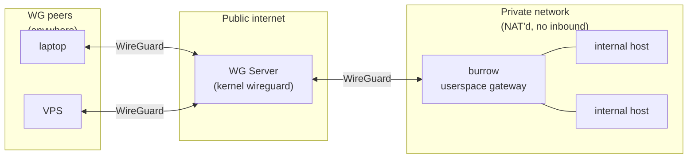
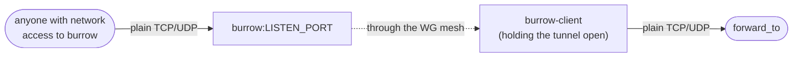
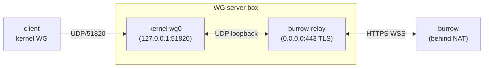

# burrow

Userspace WireGuard gateway. No TUN, no kernel drivers, no admin.

- [TL;DR](#tldr)
- [Quick start](#quick-start)
- [Examples](#examples)
- [Commands](#commands)
- [How it works](#how-it-works)
- [Limitations](#limitations)
- [Development](#development)
- [License](#license)

## TL;DR

burrow is a WireGuard peer you drop inside a private network. It acts
as a transparent MASQUERADE for other peers reaching internal hosts,
and adds SSH `-R`-style reverse tunnels (bound on real OS listeners),
a DNS resolver, and a remote shell over one control channel.

Built on [boringtun](https://github.com/cloudflare/boringtun) and
[smoltcp](https://github.com/smoltcp-rs/smoltcp).

Three-party setup: a publicly-reachable WG server in the middle, a
burrow gateway sitting inside some private network, and any number of
WG peers (your laptop, a VPS, whatever). burrow bridges the WG side to
the private LAN.



Reverse tunnels flip the direction. Any machine on burrow's network
(WG peer, LAN host, the public internet if burrow is reachable there)
hits a real OS listener on the burrow host; the connection rides back
to whichever client called `tunnel start` and is originated locally.



## Quick start

Three boxes — a public WG server, the burrow gateway behind NAT, and
one or more clients. Decisions live in **one TOML file per
deployment**, under `deployments/<name>/spec.toml`. `burrowctl`
generates the kernel-WG configs + cert + token, then cross-builds
each binary for whatever OS it lives on.

**1. Write a spec.** `deployments/dev/spec.toml`:

```toml
[wg]
endpoint = "vpn.example.com:51820"     # WG server's public host:port
routes   = ["192.168.1.0/24"]          # CIDRs the gateway exposes

[transport]
mode       = "wss"                     # or "udp"
relay_host = "vpn.example.com:443"     # required when mode = "wss"

[build]
gateway = "x86_64-pc-windows-msvc"     # required — pick the gateway host's OS
# relay  defaults to x86_64-unknown-linux-gnu
# client defaults to x86_64-unknown-linux-gnu
```

`burrowctl validate dev` parses + sanity-checks it.

**2. Generate configs and bundle materials:**

```sh
cargo run --bin burrowctl -- gen dev
# produces deployments/dev/{server.conf, burrow.conf, client1.conf,
# relay-bundle/{cert.pem, key.pem, token.txt, listen.txt, forward.txt}}
```

**3. Cross-build the three binaries:**

```sh
cargo run --bin burrowctl -- build dev
# invokes cargo three times with the right --target / --features
# / embed env vars set internally; collects the binaries into
# deployments/dev/relay-bundle/{burrow(.exe), burrow-relay, burrow-client}
```

You'll need each non-host target installed (`rustup target add
<triple>`) plus a working linker. `cross` is a drop-in cargo wrapper
that handles linkers via docker if you'd rather not set toolchains up
by hand.

**4. Ship + run** — everything you need is now in one directory:

```sh
# WG server box (kernel WireGuard + burrow-relay when on WSS)
scp deployments/dev/server.conf root@vpn.example.com:/etc/wireguard/wg0.conf
ssh root@vpn.example.com 'wg-quick up wg0'
scp deployments/dev/relay-bundle/burrow-relay root@vpn.example.com: \
    && ssh root@vpn.example.com ./burrow-relay        # WSS only

# burrow gateway, Linux host
scp deployments/dev/relay-bundle/burrow gateway-host: && ssh gateway-host ./burrow
# burrow gateway, Windows host: SMB via the built-in C$ admin share
# (or enable OpenSSH Server on the host and `scp` like Linux).
Copy-Item deployments\dev\relay-bundle\burrow.exe \\gateway-host\c$\Users\Administrator\
# then RDP / Enter-PSSession gateway-host and run .\burrow.exe

# connect peer client
sudo wg-quick up ./deployments/dev/client1.conf
```

Multiple deployments coexist — `deployments/prod/`, `deployments/staging/`,
each with its own spec + bundle. `burrowctl` always takes the
deployment name as the last positional argument.

### Legacy: `just gen-embed-wss`

Pre-`burrowctl`, the same flow lived in `just gen-embed-wss` driven
by `BURROW_TARGET` / `BURROW_RELAY_TARGET` / `BURROW_CLIENT_TARGET`
env vars and wrote into `burrow-configs/`. That recipe still works
for now, but `burrowctl` is the path forward — the env-var dance is
strictly worse to maintain than a TOML file.

### Easy deployment

`just deploy-server` automates the WG server bring-up: SSHes to the
remote, drops `server.conf` in place, runs `wg-quick up` inside an
ephemeral netns. If `burrow-configs/relay-bundle/` is present (i.e.
you used `gen-embed-wss`), it also ships `target/min/burrow-relay`
and starts it — one command stands the whole server side up.

The client side is local: `deploy-client` puts a kernel WG client
into a netns on this box; `netns-shell` drops you into it so any
traffic you generate (curl, dig, ssh) rides the tunnel.

```sh
just deploy-server --target root@vpn.example.com --key ~/.ssh/id_ed25519
just deploy-client
just netns-shell
# (inside the netns: anything you curl / dig / ssh to the exposed
#  subnets reaches through burrow.)
```

Teardown:

```sh
just deploy-server --target root@vpn.example.com --teardown
just deploy-client --teardown
```

### `--routes`: split tunnel vs full tunnel

`--routes` controls which destinations get directed through burrow.
Two modes:

- **Split tunnel** (typical): one or more specific CIDRs. Only traffic
  destined for those ranges rides the tunnel; everything else uses
  the client's normal network.

  ```sh
  just gen-embed --endpoint vpn.example.com:51820 \
      --routes 192.168.1.0/24,10.50.0.0/24
  ```

- **Full tunnel**: `0.0.0.0/0`. All client traffic goes through the WG
  server, through burrow, and out burrow's LAN uplink — burrow
  becomes a self-hosted VPN egress. MASQUERADE is implicit (it's
  already how burrow handles outbound). Pair with `--dns` so DNS has
  a reachable resolver through the tunnel:

  ```sh
  just gen-embed --endpoint vpn.example.com:51820 \
      --routes 0.0.0.0/0 --dns 10.0.0.2
  ```

  Throughput is bounded by burrow's LAN pipe; fine for a handful of
  peers, not a commercial-grade VPN service.

## Examples

All of these run from inside the client netns (`just netns-shell`) so
traffic uses the tunnel. `10.0.0.2` is the burrow host's WG address in
the examples — adjust for your subnet.

### Reach an internal host

Plain clients over the tunnel. Nothing burrow-client-specific:

```sh
curl http://192.168.1.10/
ssh user@192.168.1.50
psql -h 192.168.1.20 -U postgres
```

### DNS

burrow answers A queries on `wg_ip:53` using the burrow host's system
resolver (on by default; `DnsEnabled = true` in `burrow.conf`):

```sh
dig @10.0.0.2 internal.corp.lan
```

Pass `--dns 10.0.0.2` to `burrow-client gen` to have the generated
client.conf set `DNS = 10.0.0.2`, so wg-quick points every tool's
resolver at burrow automatically while the tunnel is up.

### Reverse tunnel — expose a local service

SSH `-R`, but over WG. The burrow host binds a real OS listener;
connections tunnel back here and originate on `forward_to` locally.

```sh
# Anything that connects to burrow_host:443 lands on 127.0.0.1:8080.
burrow-client tunnel 10.0.0.2 start -R 443:127.0.0.1:8080
# Hold Ctrl-C to stop — burrow-client holds the control flow open
# for the tunnel's lifetime.
```

`HOST` can be a hostname — resolved on the machine running
`burrow-client` when a connection arrives, using whatever DNS
the client's system has configured. That includes burrow's built-in
resolver if `client.conf` set `DNS = 10.0.0.2` (pass `--dns` to
`burrow-client gen`); otherwise it uses the client's system resolver
/ `/etc/resolv.conf`.

```sh
burrow-client tunnel 10.0.0.2 start -R 443:db.internal.example.com:5432
```

`-R [BIND:]LISTEN:HOST:PORT` — BIND defaults to `0.0.0.0` (all OS
interfaces on the burrow host). Pin to one interface with
`-R 192.168.1.50:443:127.0.0.1:8080`. `-U` for UDP. Stop by id:

```sh
burrow-client tunnel 10.0.0.2 list
burrow-client tunnel 10.0.0.2 stop 42
```

### Shell — interactive

PTY session on the burrow host (default mode):

```sh
burrow-client shell 10.0.0.2
# drops into cmd.exe on Windows, $SHELL / /bin/sh on Unix
```

### Shell — one-shot

Run a command, capture stdout + stderr + exit code, return:

```sh
# `--output -` pipes captured output to the local terminal:
burrow-client shell 10.0.0.2 --output - --program whoami

# `--output <path>` writes it to a file (stderr still goes to terminal):
burrow-client shell 10.0.0.2 --output build.log --program make
```

### Shell — fire-and-forget

Spawn detached; the server returns the pid and the process outlives
the `burrow-client` invocation. Nothing is captured.

```sh
burrow-client shell 10.0.0.2 --detach --program ./long-running-task
# 47412        <- pid printed to local stdout
```

### Shell — custom program + argv

`--program` picks the executable; anything after `--` is argv:

```sh
burrow-client shell 10.0.0.2 --program /usr/bin/python3 -- -i
burrow-client shell 10.0.0.2 --program cmd.exe -- /c "dir C:\"
```

### WSS transport — burrow over HTTPS

Some networks block egress UDP (corporate, hotel, captive-portal). For
those, the server↔burrow leg can ride an HTTPS WebSocket served by
**burrow-relay**, a small sidecar that sits next to kernel `wg0` on
the WG server box and bridges WS frames to local UDP. The
client↔server leg stays plain WG/UDP — only burrow has to know.



The `gen-embed-wss` recipe builds a paired `(burrow, burrow-relay)`
package: matching keys, matching token, matching cert — both binaries
self-contained and runnable with **no CLI args**. No Let's Encrypt,
no systemd unit, no `/etc/burrow-relay/` provisioning.

```sh
# One command produces:
#   target/min/burrow            -- WG keys + transport URL + token + skip-verify embedded
#   target/min/burrow-relay      -- TLS cert + key + token embedded
#   target/min/burrow-client     -- companion CLI
#   burrow-configs/server.conf   -- kernel wg-quick on the WG server
#   burrow-configs/client1.conf  -- kernel wg-quick on each client
just gen-embed-wss --endpoint vpn.example.com:51820 \
                   --routes 192.168.1.0/24 \
                   --relay vpn.example.com:443
```

`--relay HOST[:PORT]` — where burrow will dial. The host part lands
in the cert's SAN; default port 443. Use any reachable address —
DNS hostname, public IP literal, or a wildcard-DNS service like
`159-65-218-242.nip.io`. The cert is freshly-generated ECDSA P-256
self-signed; burrow trusts it because `gen --relay` flips the
`TlsSkipVerify=true` bit in `burrow.conf`. Bearer-token auth is
still enforced; the TLS layer is pure obfuscation.

Run model — three boxes, three commands, no args anywhere:

```sh
# 1. WG server box (kernel WireGuard server)
sudo wg-quick up ./server.conf
./burrow-relay     # foreground; nohup or tmux it if you want it detached

# 2. burrow gateway (the host inside the private network)
./burrow

# 3. each client peer
sudo wg-quick up ./client1.conf
```

burrow.conf for the embed-mode build looks like this — the `Transport`,
`RelayToken`, and `TlsSkipVerify` lines are how the existing wg-quick
INI carries the WSS extras through the same embed mechanism that
already exists:

```ini
[Interface]
PrivateKey = ...
Address = 10.0.0.2/24
ControlPort = 57821
DnsEnabled = true
Transport = wss://vpn.example.com:443/v1/wg
RelayToken = <base64>
TlsSkipVerify = true

[Peer]
PublicKey = ...
Endpoint = vpn.example.com:51820       # ignored when Transport is set
AllowedIPs = 10.0.0.0/24
PersistentKeepalive = 25
```

If you'd rather skip the embed step (e.g. use a CA-issued cert from a
real DNS name), all three settings have CLI flags too:
`--transport wss://host/v1/wg`, `--relay-token TOKEN` (or
`BURROW_RELAY_TOKEN` env), `--tls-skip-verify`. Drop
`--tls-skip-verify` when the relay's cert is signed by a CA that's
in webpki-roots. Build burrow-relay normally
(`cargo build --release --bin burrow-relay`) and pass `--cert`/`--key`/
`--token`/`--listen`/`--forward-to` at runtime.

If the relay is unreachable, the burrow gateway keeps retrying with
capped exponential backoff. WG handshakes restart automatically once
the connection comes back.

## Commands

```
burrow [--config <PATH>] [--transport <URL>]   # the gateway
                                               # (URL: udp://host:port or wss://host/v1/wg)
burrow-client tunnel <wg_ip> start -R ...      # reverse tunnels (TCP; -U for UDP)
burrow-client shell  <wg_ip>                   # interactive PTY on the burrow host
burrow-client keygen                           # base64 x25519 keypair
burrow-client gen ... [--relay HOST[:PORT]]    # write server/burrow/client configs
                                               # (--relay also produces a relay-bundle/)
burrow-relay [--cert ... --key ...]            # WSS↔UDP bridge; CLI args optional under
                                               # --features embedded-relay-bundle
```

```
just gen-embed              # UDP transport: pair of binaries + WG configs
just gen-embed-wss          # WSS transport: same, plus burrow-relay with bundle baked in
```

`--help` on any subcommand for the full option surface. `just --list`
for build / deploy recipes.

## How it works

1. boringtun decrypts inbound WG datagrams to raw IPv4.
2. burrow's NAT table records the original destination and rewrites it
   to smoltcp's virtual IP + per-flow gateway port. smoltcp is a
   userspace TCP/IP stack; no TUN, no OS-level interfaces.
3. For TCP, burrow dials the original destination as a real OS
   `TcpStream` first — only on success does smoltcp answer the peer's
   SYN. Closed ports get an RST, not a false SYN-ACK.
4. UDP bypasses smoltcp: per-flow `UdpSocket`, idle-swept after 30s.
5. Reverse tunnels bind real OS listeners on the gateway. Incoming
   connections are yamux-multiplexed back to the owning client, which
   originates the `forward_to` connection locally.
6. The WG transport is pluggable behind a `WgTransport` trait. UDP
   is the default; WSS rides binary WebSocket frames over TLS to a
   `burrow-relay` sidecar on the WG server box, which bridges back
   to kernel `wg0` over loopback UDP. Adding HTTP/2, QUIC, or a
   raw-TCP framing is a localised change behind that trait.

On the WG server: standard `AllowedIPs` routing, `ip_forward = 1`. No
custom daemon required for the UDP transport. For WSS, run
`burrow-relay` next to kernel `wg0`.

## Limitations

- IPv4 only. No IPv6.
- A burrow instance holds a single WG identity and talks to one
  server endpoint — the parser rejects a second `[Peer]` and the
  runtime only drives one. If you need more, run multiple burrow
  instances with distinct configs (their own keys, wg_ips, control
  ports). They can all peer with the same WG server (it's just more
  `[Peer]` entries server-side) or with different ones — burrow
  doesn't care.
- ICMP without raw sockets returns admin-prohibited rather than
  forwarding; raw sockets need `CAP_NET_RAW` / Administrator.
- Pure layer-3/4 NAT — no ALG (Application Layer Gateway). Protocols
  that embed addresses in their payload (FTP active/PASV, SIP, H.323,
  ...) break without a helper that parses and rewrites those embedded
  addresses. Linux's `nf_conntrack_ftp` / `nf_nat_ftp` etc. are the
  kernel equivalents; burrow has no analog.

## Development

```sh
cargo test                              # ~145 lib + integration tests
cargo clippy --all-targets -- -D warnings
```

See `justfile` for cross-compile recipes and `scripts/` for the deploy
helpers.

## License

BSD-3-Clause (matches boringtun).
